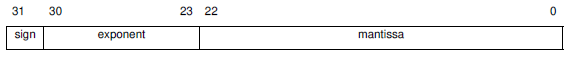

# Exam of 22.02.2021
Exam of the Computer Architectures course of the master degree in Embedded System (Electronic Engineering) of Politecnico di Torino.<br/>
Tested in EMU8086 version 4.08 and Keil uVision5.<br/>

## Exam Text
Assembly subroutines must comply with the ARM Architecture Procedure Call Standard (AAPCS) standard (about parameter passing, returned value, calleesaved
registers).

### Specification 1
Write the `getMaxAbsoluteValue` function in C language, having the following prototype:
int getMaxAbsoluteValue(float parameter1, float parameter2)
The function returns 1 if the absolute value of parameter1 is higher than or equal to the absolute value of parameter2, 0 otherwise.
Then, write the Reset_Handler procedure in an assembly file that calls the C function passing two parameters.
Note 1: the two parameters in the Reset_Handler can be initialized to any value; anyway, it should be noted that their value is considered according to the IEEE-754
SP standard. This standard expresses floating-point numbers in 32 bits:

ss6.png



Bit 31 is 0 if the number is positive, 1 if negative.

Some notable values are:

- Note 2: it is important to add proper directives in the C and/or assembly file in order to guarantee the visibility of the getMaxAbsoluteValue function.

### Specification 2
Write the `getAbsoluteDifference` subroutine in ARM assembly, which receives in input two 32-bit numbers, considers them as IEEE-754 SP floating point numbers,
and returns their absolute difference (in the same format).

In details, the subroutine implements the following steps:

1. pass the two parameters to the getMaxAbsoluteValue function. If the result of the function is 0, swap the two parameters
2. the exponent of the result is the same as the exponent of the first parameter; the sign of the result is 0
3. take the mantissa of the two parameters
4. set bit 23 of both mantissas to 1
5. if the exponent of the second parameter is lower than the exponent of the first parameter, shift right the mantissa of the second parameter
by as many positions as the difference between the two exponents
6. check the sign of the two parameters.
If the sign is the same:
    a) the mantissa of the result is the difference between the mantissa of the first parameter and the mantissa of the second parameter
    b) As long as bit 23 of the mantissa of the result is 0:
        - shift left the mantissa of the result by one position
        - decrement the exponent of the result by one
Instead, if the two parameters have different sign:
    a) sum the two mantissas: this is the mantissa of the result
    b) If bit 24 of the mantissa of the result is 1:
        - shift right the mantissa of the result by one position
        - increment the exponent of the result by one
7. set bit 23 of the mantissa of the result to 0
8. combine sign, exponent, and mantissa to get the final result.

#### Example
`parameter1 = 0100 0000 0100 1001 0000 1111 1101 1011`<br/>
`parameter2 = 1100 0001 1111 0110 1100 1011 1110 0100`
1. the getMaxAbsoluteValue function returns 0, so:<br/>
  `parameter1 = 1100 0001 1111 0110 1100 1011 1110 0100`<br/>
  `parameter2 = 0100 0000 0100 1001 0000 1111 1101 1011`
2. `exponentResult = 1000 0011`<br/>
  `signResult = 0`<br/>
3. `mantissa1 = 0000 0000 0111 0110 1100 1011 1110 0100`<br/>
    `mantissa2 = 0000 0000 0100 1001 0000 1111 1101 1011`<br/>
4.  `mantissa1 = 0000 0000 1111 0110 1100 1011 1110 0100`<br/>
    `mantissa2 = 0000 0000 1100 1001 0000 1111 1101 1011`
5.  `exponent1 = 1000 0011`
    `exponent2 = 1000 0000`    
6. the parameters have different sign<br/>
    `a) mantissaResult = 0000 0001 0000 1111 1110 1101 1101 1111`<br/>
    `b) mantissaResult = 0000 0000 1000 0111 1111 0110 1110 1111`
7. `mantissaResult = 0000 0000 0000 0111 1111 0110 1110 1111`
8. `result = 0100 0010 0000 0111 1111 0110 1110 1111`

### Specification 3
Given a 5 x 5 matrix of bytes SOURCE representing unsigned numbers, write a 8086 assembly program which computes on 16 bits the sum of all cells excluding
these on the main diagonal, i.e. upper left-to-lower-right diagonal, minus the sum of all the cells of the same main diagonal.
Please add significant comments to the code and instructions.
Friendly advice: before starting to write down the code, think at a possible (very) simple algorithm! The choice of the algorithm highly influences the complexity and
length of the code.

#### Example
matrix  `SOURCE`
```
1 2 3 4 5
6 7 8 9 0
9 8 7 6 5
4 3 2 1 0
7 7 7 7 7
```
all cells excluding the main `DIAGONAL: `
```
2+3+4+5+
6+8+9+0+
9+8+6+5+
4+3+2+0+
7+7+7+7= 102
```
all cells the main `DIAGONAL: `
1+
7+
7+
1+
7= 23

`Result: ` (on 16 bits in two’s complement) = 102-23 = 79